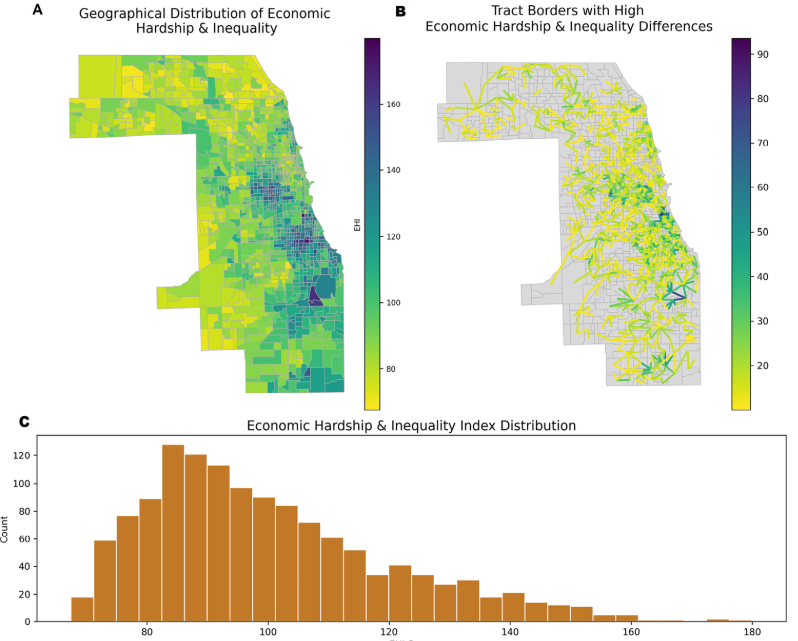

# Pushing the Boundary of Child Wellbeing: A Spatial Examination of Child Death Rates in Transition Zones of Extreme Economic Inequality and Material Hardship

## Abstract
How do patterns of socioeconomic inequality shape the risk of child fatality in urban areas? Studies have demonstrated that intentional and accidental deaths of children are highly clustered into areas of social disadvantage. However, in complex urban settings, the risk of death to children is likely to exhibit a more localized spatial structure characterized by rapid changes in child fatality risk. The present research uses Bayesian hierarchical modeling to detect spatial discontinuities in child fatality risk in transition areas defined by elevated levels of economic hardship and inequality (EHI). The analysis detected 413 neighborhood boundaries characterized by extreme differences in EHI (i.e., a difference of four deciles). Living in proximity to a boundary of extreme difference, called a social frontier, is associated with a 22% higher relative risk of child fatality beyond measures of neighborhood racial segregation, concentrated disadvantage, residential mobility, and immigrant concentration. The significance of identifying neighborhoods characterized as a social frontier where children may benefit from additional preventive interventions is discussed in context.

**Reference:**  
Barboza-Salerno, G., *Liebhard, B., *Duhaney, S., & Shockley-McCarthy, K. (2025). *Pushing the boundary of child wellbeing: A spatial examination of child death rates in transition zones of extreme economic inequality and material hardship.* PLOS ONE (in press).

---

## Project Overview
This repository contains R code and analysis for a spatial Bayesian study of **child mortality rates** in Cook County, Illinois. The analysis examines how **economic inequality** and **material hardship** shape child deaths within transition zones, using **CARBayes dissimilarity models** to evaluate spatial clustering and contextual risk.

---

## 1. Libraries and Setup
The workflow relies on spatial, statistical, and Bayesian modeling packages, including:

- Data management: `tidyverse`, `readr`, `dplyr`, `lubridate`, `scales`
- Spatial data: `sf`, `sp`, `spdep`, `tidycensus`, `sociome`
- Modeling: `CARBayes`, `MASS`, `matrixStats`, `car`
- Visualization: `ggplot2`, `GGally`, `stargazer`

---

## 2. Data Acquisition
- **Child death data:** Pulled directly from the Cook County Medical Examiner’s Office using the Socrata API. Restricted to **cases under age 18** with death dates between **2015–2023**.  
- **Decennial Census (2010):** Population and racial/ethnic composition at the tract level.  
- **ACS 5-Year (2015):** Indicators of socioeconomic status, housing stability, language access, and education.  
- **Area Deprivation Index (2018):** Imported using the `sociome` package to capture tract-level hardship and inequality.

---

## 3. Data Preparation
- Converted date fields (`incident_date`, `death_date`) and demographics (`age`, `gender`, `race`).  
- Created tract-level covariates:
  - **Concentrated disadvantage** (factor analysis of unemployment, poverty, education, single motherhood, occupation).  
  - **Residential instability** (housing mobility, vacancy, renter occupancy).  
  - **Immigrant concentration** (English proficiency and language isolation).  
- Geocoded child death records joined spatially to census tracts.  
- Aggregated child deaths (`adi_infdeath`) to tract level.  
- Merged census, ACS, and ADI data into a unified tract-level dataset.

---

## 4. Spatial Modeling
- Constructed neighbor list (`poly2nb`) and adjacency matrix (`nb2mat`).  
- Defined a **Poisson CAR dissimilarity model** (`S.CARdissimilarity`) with:
  - Response: count of child deaths (`adi_infdeath`)  
  - Predictors: `con_disadv`, `res_instab`, `immi_con`  
  - Spatial weights: adjacency matrix **W**  
  - Dissimilarity covariate: deciles of ADI inequality (`EHI_decile`)  
- Model run with MCMC sampling:
  - Burn-in: 20,000  
  - Samples: 100,000  
  - Thinning: 10  

Outputs include:
- Posterior means, 95% credible intervals, and step-change detection.  
- Pairwise posterior correlation checks using `GGally::ggpairs`.  

---

## 5. Sensitivity Analysis
- Iteratively varied **thresholds (1–6)** of ADI deciles to test robustness.  
- For each threshold, re-fit CAR dissimilarity model with updated dissimilarity matrix.  
- Extracted posterior means, intervals, `alpha.min`, and number of step changes.  
- Compiled results into a sensitivity table.

---

## 6. Visualization
- Correlation matrix and scatter/density plots of posterior samples.  
- Geographic visualization of tracts by ADI deciles and child death counts.  
- Step-change detection maps to highlight transition zones of extreme inequality.  

---

## Outputs
- **Model diagnostics:** Posterior summaries of fixed effects and dissimilarity term.  
- **Sensitivity results:** Threshold-based robustness checks for inequality-driven clustering.  
- **Spatial maps:** Child death counts, ADI inequality deciles, and step-change boundaries.  
- **Visual analytics:** Posterior correlation plots (`GGally`), model convergence summaries.  

---

## 🔧 Requirements
- R version ≥ 4.0  
- Packages: `sociome`, `tidycensus`, `CARBayes`, `sf`, `spdep`, `ggplot2`, `GGally`, `tidyverse`  
- Census API key required for `tidycensus` functions.  

---

## How to Run
1. Clone this repository.  
2. Ensure the following inputs are available:
   - Cook County Medical Examiner child death data (API call included).  
   - Decennial Census and ACS indicators (downloaded automatically via `tidycensus`).  
   - ADI indicators (via `sociome`).  
3. Run the R script sequentially:
   - Data download and cleaning  
   - Census/ACS merge  
   - Construct dissimilarity matrices  
   - Fit CARBayes dissimilarity models  
   - Sensitivity analysis and visualization  

---

## Citation
If you use or adapt this code, please cite:  

Barboza-Salerno, G., *Liebhard, B., *Duhaney, S., & Shockley-McCarthy, K. (2025). *Pushing the boundary of child wellbeing: A spatial examination of child death rates in transition zones of extreme economic inequality and material hardship.* PLOS ONE.

---
